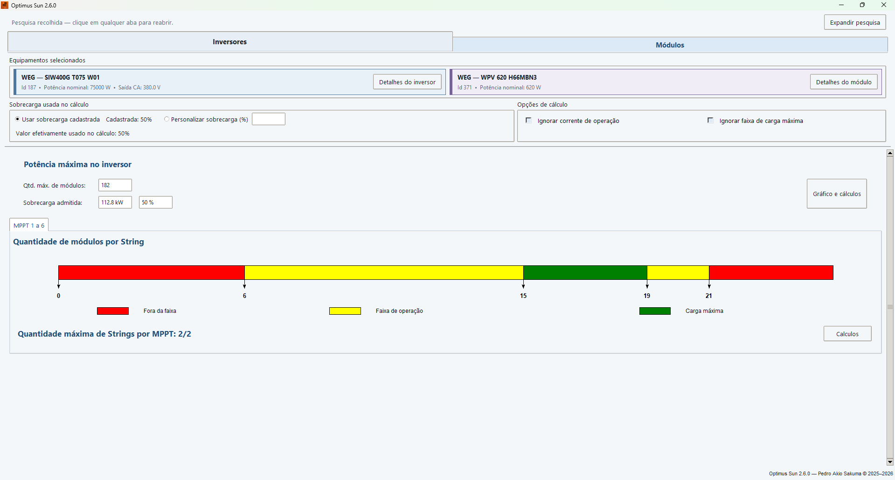

# Optimus Sun

O **Optimus Sun** é um projeto independente desenvolvido por **Pedro Akio Sakuma** para auxiliar no dimensionamento de sistemas fotovoltaicos. A aplicação relaciona modelos de inversores e módulos solares, verifica sua compatibilidade elétrica e operacional e apresenta limites de operação para apoiar a análise do arranjo.

**Versão atual: v2.3.8**

A `v2.3.7` marcou a primeira release pública formal do Optimus Sun distribuída com Git tags e GitHub Releases. Ela não foi a primeira versão do software; versões anteriores permanecem preservadas no histórico do Git.

A `v2.3.8` é uma release de estabilidade e interface, com correções nos cálculos de limites, melhorias no gerenciamento do banco de dados e das janelas auxiliares, testes automatizados e aprimoramentos visuais e de responsividade.

## Funcionalidades

- Seleção de inversores e módulos fotovoltaicos pré-cadastrados.
- Verificação de compatibilidade com base nos parâmetros elétricos dos equipamentos.
- Cálculo das quantidades mínima e máxima de módulos por string e por MPPT.
- Análise da quantidade de strings e da potência do arranjo por MPPT e por inversor.
- Exibição de limites de tensão, corrente, potência e condições de operação.
- Visualizações e gráficos interativos gerados com Matplotlib.
- Resumo das capacidades e restrições do arranjo analisado.

## Operação rápida

O dimensionamento é atualizado automaticamente depois que um inversor e um módulo são selecionados:

1. Escolha o **fabricante do inversor** e, em seguida, o modelo do inversor.
2. Escolha o **fabricante do módulo** e, em seguida, o modelo do módulo.
3. Confira a quantidade máxima de módulos, a sobrecarga admitida e as abas de cada MPPT.
4. Use **Detalhes** para consultar os dados técnicos do inversor ou do módulo selecionado.
5. Use **Cálculos** na aba do MPPT para comparar os limites de strings e de módulos por string.
6. Use **Cálculos** ao lado de **Potência máxima no inversor** para abrir o resumo geral do arranjo.



Na faixa de módulos por string, as cores têm os seguintes significados:

- **Vermelho — Fora da faixa:** combinação não admitida pelos limites calculados.
- **Amarelo — Faixa de operação:** quantidade de módulos compatível com a operação do MPPT.
- **Verde — Carga máxima:** intervalo que também atende à condição de carga máxima.

As caixas **Ignorar corrente de operação** e **Ignorar faixa de carga máxima** retiram o respectivo critério da determinação do limite. Use-as somente quando houver uma justificativa técnica e valide o resultado nos documentos dos fabricantes.

Para conhecer todas as telas, os gráficos e a interpretação de cada resultado, consulte o [Guia de operação](docs/GUIA_DE_OPERACAO.md).

## Download

As distribuições para Windows são disponibilizadas na seção **Releases** deste repositório.

Para utilizar uma release:

1. Acesse **Releases** e baixe o arquivo ZIP da versão desejada.
2. Extraia todo o conteúdo do ZIP.
3. Mantenha a estrutura da pasta extraída.
4. Execute o arquivo principal do Optimus Sun dentro dessa pasta.

A distribuição Windows é gerada com PyInstaller no modo `--onedir`. Por isso, o executável depende dos demais arquivos da pasta distribuída e não deve ser movido ou utilizado isoladamente.

## Banco de dados

O arquivo SQLite `src/optimus_sun.db` é o banco-base do projeto, é versionado no Git e é utilizado diretamente na execução pelo código-fonte.

Na distribuição para Windows, uma cópia de `optimus_sun.db` deve permanecer ao lado do executável. Ela é externa ao bundle do PyInstaller, não fica embutida no `.exe` e pode ser modificada localmente pela aplicação.

O aplicativo principal consulta nesse banco os dados de inversores, módulos e demais parâmetros. O aplicativo de cadastros pode modificar o mesmo arquivo, permitindo que as duas aplicações compartilhem os mesmos dados.

Na distribuição Windows, mantenha a cópia de `optimus_sun.db` na mesma pasta do executável principal. Ao executar pelo código-fonte, utilize o banco-base já presente em `src/`, ao lado de `optimus_sun.py`.

## Aplicativo de cadastros

O arquivo `src/cadastros_db_gui.py` fornece uma interface administrativa para cadastrar e editar as informações utilizadas pelo Optimus Sun.

Esse aplicativo não é necessário para usuários que apenas desejam realizar análises usando um banco já preparado. Quando utilizado, deve acessar o mesmo `optimus_sun.db` empregado pelo aplicativo principal.

## Executando pelo código-fonte

### Pré-requisitos

- Python 3;
- Tkinter;
- Matplotlib;
- Pillow;
- SQLite, normalmente incluído na biblioteca padrão do Python.

Tkinter costuma acompanhar a instalação oficial do Python para Windows. Instale as demais dependências Python com:

```bash
pip install matplotlib pillow
```

O repositório já contém o banco-base `src/optimus_sun.db`. Execute o aplicativo principal a partir da raiz do repositório:

```bash
python src/optimus_sun.py
```

Para abrir o aplicativo de cadastros usando o mesmo banco, entre no diretório `src/` antes da execução:

```bash
cd src
python cadastros_db_gui.py
```

## Estrutura do projeto

```text
optimussun/
├── docs/
│   └── GUIA_DE_OPERACAO.md
├── screenshots/
│   ├── scrsht_1.png
│   ├── scrsht_2.png
│   ├── scrsht_3.png
│   └── scrsht_4.png
├── src/
│   ├── compatibility/
│   │   ├── __init__.py
│   │   ├── engine.py
│   │   ├── matrix.py
│   │   ├── models.py
│   │   └── repository.py
│   ├── optimus_sun.py
│   ├── optimus_lib.py
│   ├── cadastros_db_gui.py
│   ├── optimus_sun.db
│   ├── optimus_sun.png
│   └── optimus_sun.ico
├── tests/
│   ├── test_compatibility_engine.py
│   ├── test_compatibility_csv.py
│   ├── test_compatibility_matrix.py
│   ├── test_optimus_lib.py
│   └── test_database_regression.py
├── tools/
│   ├── compatibility_demo.py
│   └── compatibility_matrix_gui.py
├── .gitignore
├── LICENSE
└── README.md
```

- `src/optimus_sun.py`: aplicação principal e interface de dimensionamento.
- `src/optimus_lib.py`: funções auxiliares de validação e cálculo.
- `src/compatibility/`: modelos, carregamento SQLite e motor reutilizável de compatibilidade em desenvolvimento para a futura v2.5.0.
- `tools/compatibility_matrix_gui.py`: interface provisória para montar e inspecionar matrizes de compatibilidade.
- `src/compatibility/csv_io.py`: importação e exportação da representação visível da matriz em CSV.
- `src/cadastros_db_gui.py`: interface administrativa do banco de dados.
- `src/optimus_sun.db`: banco-base SQLite versionado e usado na execução pelo código-fonte.
- `src/optimus_sun.png` e `src/optimus_sun.ico`: identidade visual e ícone da aplicação.
- `docs/GUIA_DE_OPERACAO.md`: procedimento detalhado de uso e interpretação dos resultados.
- `screenshots/`: capturas das principais telas utilizadas na documentação.
- `tests/`: testes automatizados dos cálculos e regressão com o banco operacional local.

## Arquitetura básica

A interface principal em Tkinter coleta a seleção do inversor e do módulo, consulta seus parâmetros no banco SQLite e utiliza as funções de `optimus_lib.py` para apoiar as validações e os cálculos. Os resultados são organizados na própria interface, com gráficos produzidos pelo Matplotlib. O aplicativo de cadastros atua separadamente sobre o mesmo banco.

Na branch de desenvolvimento da futura v2.5.0, `src/compatibility/` fornece um motor independente da GUI. Ele recebe dados estruturados do inversor, módulo, MPPTs e opções da análise, enumera configurações fisicamente possíveis e devolve um resultado estruturado. Essa funcionalidade ainda não altera a versão publicada v2.3.8 nem está integrada ao layout principal. Consulte a [documentação do motor de compatibilidade](docs/MOTOR_DE_COMPATIBILIDADE.md).

A matriz provisória pode ser executada, a partir da raiz do projeto, com:

```powershell
py -3 -X utf8 -B tools\compatibility_matrix_gui.py
```

Os seletores da matriz apresentam somente inversores e módulos ativos,
ordenados por fabricante e modelo. A ativação dos cadastros pode ser administrada
em `cadastros_db_gui.py`. A associação interna usa o ID real do banco; o texto do
combobox é apenas descritivo. Na primeira coluna da matriz aparece somente o
texto da ocorrência — por padrão, o modelo, ou o rótulo personalizado definido
pelo usuário. Fabricante e modelo real continuam preservados para cálculo, CSV,
associação e detalhes.

Na própria janela, use **Exportar CSV** após calcular ou importar uma matriz. O
arquivo é gravado em UTF-8 com BOM, separado por ponto e vírgula e com números
em formato decimal brasileiro. Cada módulo ocupa três colunas: quantidade,
potência em kW e sobrecarga, identificadas pelo modelo em uma única linha de
cabeçalho. A exportação usa exatamente o resultado exibido na
matriz (`display_result`) e preserva rótulos repetidos/personalizados e a ordem
manual dos módulos.

**Importar CSV** carrega e mostra os valores existentes no arquivo sem executar
o motor. Modelos com correspondência textual exata no banco ativo são
associados automaticamente; os demais ficam marcados como não associados e
podem ser vinculados manualmente pelos botões **Associar**. Somente
**Recalcular matriz** substitui os valores importados por novos cálculos. Consulte
o [formato CSV da matriz](docs/CSV_MATRIZ.md) para a estrutura e as limitações.

Na matriz, `Não suporta | 0 | -` significa que o cálculo foi possível, mas não
encontrou configuração válida. `N/D | N/D | N/D` indica dados insuficientes. A
corrente máxima de operação é a única restrição com comparação flexibilizada;
faixa MPPT, Voc máximo corrigido e Isc máximo permanecem limites obrigatórios.

## Tecnologias utilizadas

- **Python** — linguagem principal do projeto.
- **Tkinter** — construção das interfaces gráficas.
- **SQLite** — armazenamento local dos dados dos equipamentos.
- **Matplotlib** — gráficos e visualizações dos limites operacionais.
- **Pillow** — carregamento e tratamento das imagens da interface.
- **PyInstaller** — geração da distribuição para Windows.
- **Excel** — ferramenta auxiliar usada durante o desenvolvimento e a organização de dados; não é uma dependência para executar o Optimus Sun.

## Limitações e responsabilidade técnica

O Optimus Sun é uma ferramenta de apoio ao dimensionamento. Seus resultados devem ser conferidos com os datasheets e manuais dos fabricantes, as normas aplicáveis e as condições reais de cada projeto. O software não substitui a análise e a validação de um profissional tecnicamente habilitado.

## Histórico de versões

Versões antigas foram historicamente mantidas em diretórios próprios. A partir da v2.3.7, a branch `main` representa o estado atual do projeto, enquanto as versões públicas passam a ser identificadas por Git tags e distribuídas por GitHub Releases. O histórico anterior continua disponível nos commits do repositório.

## Licença

Este projeto é distribuído sob a **MIT License**. Consulte o arquivo [LICENSE](LICENSE) para conhecer os termos.

## Autoria

**Pedro Akio Sakuma**
