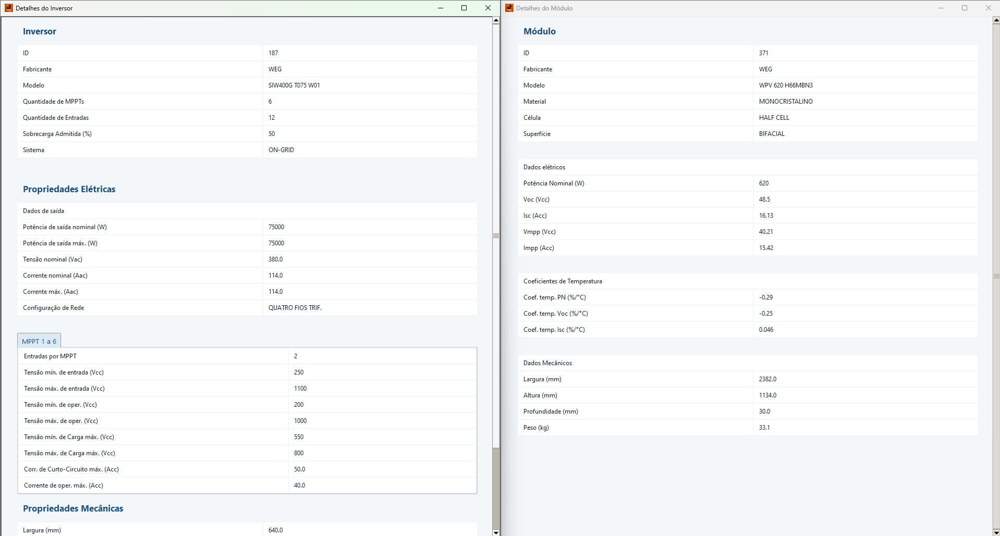
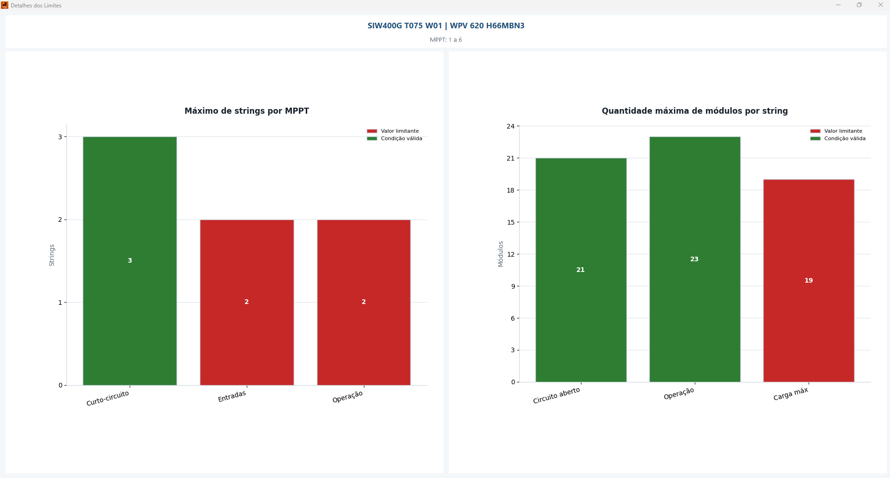
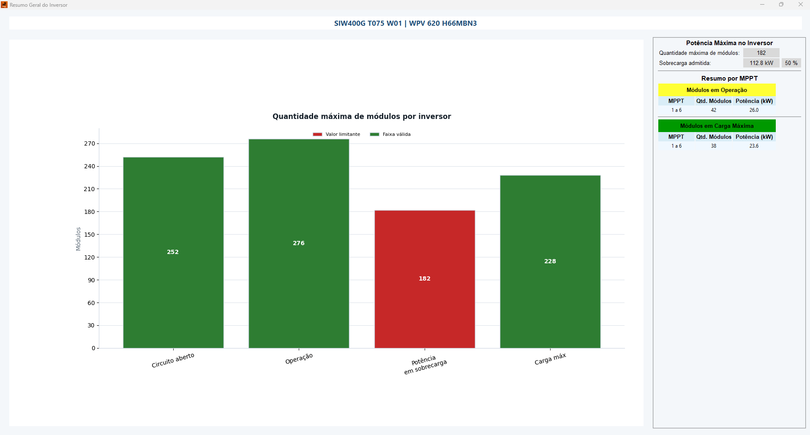
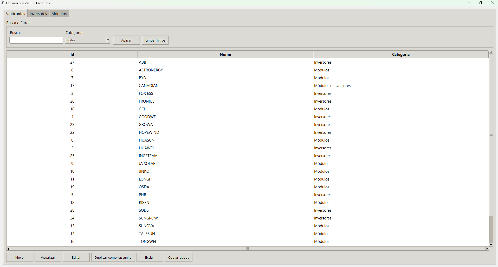
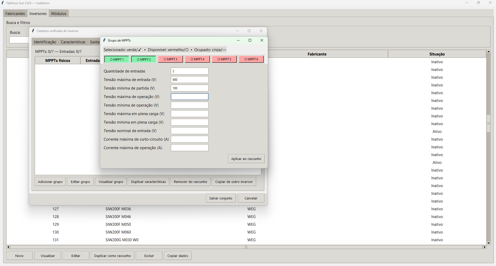
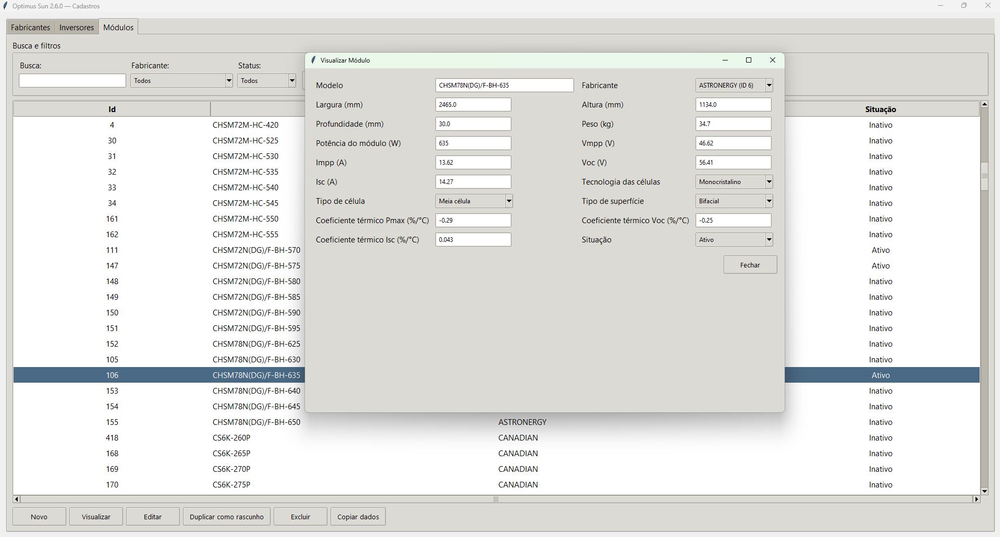
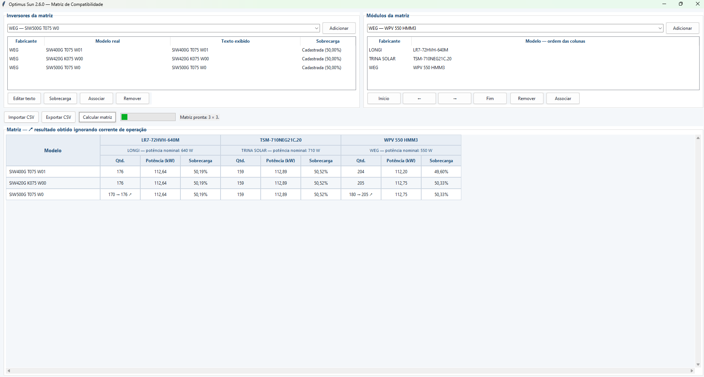

# Optimus Sun

O **Optimus Sun** é um projeto independente desenvolvido por **Pedro Akio Sakuma** para auxiliar no dimensionamento de sistemas fotovoltaicos. A aplicação relaciona modelos de inversores e módulos solares, verifica sua compatibilidade elétrica e operacional e apresenta limites de operação para apoiar a análise do arranjo.

**Versão atual: v2.6.0**

A `v2.6.0` amplia a operação dos três aplicativos separados do projeto: a interface principal recebe pesquisa independente de equipamentos, seleção explícita, filtros avançados, pesquisa recolhível, sobrecarga personalizada e navegação por teclado; o aplicativo de cadastros passa a oferecer edição unificada de inversores e grupos de MPPT; e a Matriz de Compatibilidade recebe aprimoramentos de desempenho, apresentação e interoperabilidade CSV.

O motor de compatibilidade, introduzido na `v2.5.0`, analisa combinações inversor × módulo, distingue `Não suporta` de `N/D` e compara o modo normal com o modo que ignora corrente de operação. A matriz permite importar e exportar CSV, preserva valores importados sem recálculo automático e identifica por `↗` os resultados beneficiados pela flexibilização da corrente.

A `v2.3.8` é uma release de estabilidade e interface, com correções nos cálculos de limites, melhorias no gerenciamento do banco de dados e das janelas auxiliares, testes automatizados e aprimoramentos visuais e de responsividade.

A `v2.3.7` marcou a transição do Optimus Sun para uma identidade independente e para o fluxo atual de versionamento e distribuição por Git tags e GitHub Releases.

A `v2.2.6` foi uma release oficial de estabilização da versão, organização do repositório, ajustes internos, melhorias de manutenção e atualização do banco de dados.

## Funcionalidades

- Seleção de inversores e módulos fotovoltaicos pré-cadastrados.
- Verificação de compatibilidade com base nos parâmetros elétricos dos equipamentos.
- Cálculo das quantidades mínima e máxima de módulos por string e por MPPT.
- Análise da quantidade de strings e da potência do arranjo por MPPT e por inversor.
- Exibição de limites de tensão, corrente, potência e condições de operação.
- Visualizações e gráficos interativos gerados com Matplotlib.
- Resumo das capacidades e restrições do arranjo analisado.
- Matriz de compatibilidade inversor × módulo com múltiplos equipamentos.
- Repetição de inversores com rótulos e sobrecarga independentes por ocorrência.
- Comparação entre modo normal e modo ignorando corrente de operação, com indicador `↗` quando há ganho.
- Fatores limitantes estruturados e detalhes técnicos por combinação.
- Importação e exportação CSV com associação manual e recálculo explícito.

## Operação rápida

O dimensionamento é atualizado automaticamente depois que um inversor e um módulo são selecionados:

1. Na aba **Inversores**, pesquise por Id, modelo ou fabricante e selecione uma linha.
2. Na aba **Módulos**, faça a pesquisa equivalente e selecione uma linha; fabricante é um filtro opcional.
3. Se necessário, use **Filtros avançados…** e configure a sobrecarga cadastrada ou personalizada.
4. Confira a quantidade máxima de módulos, a sobrecarga obtida e as abas de cada MPPT.
5. Use **Detalhes do inversor** e **Detalhes do módulo** para consultar os cadastros selecionados.
6. Use **Gráfico e cálculos** no resultado geral ou o botão de cálculos de cada MPPT para inspecionar os limites.

## Capturas da interface

### Visão geral


*Interface principal da v2.6.0: equipamentos selecionados e resultados, com a pesquisa recolhida para ampliar a área dos gráficos.*

A pesquisa de inversores e a de módulos são independentes, preservam seus próprios filtros e exigem a confirmação explícita da linha escolhida. Depois de uma seleção válida e do cálculo, a pesquisa pode ser recolhida e reaberta pelas abas ou pelo botão da interface. A sobrecarga utilizada pode ser a cadastrada ou uma porcentagem personalizada para a sessão.

<details>
<summary><strong>Detalhes dos equipamentos e gráficos de limites</strong></summary>



*Consulta das características elétricas e mecânicas do inversor e do módulo selecionados.*



*Comparação dos limites de strings por MPPT e de módulos por string para a combinação selecionada.*



*Resumo dos limites de quantidade de módulos por inversor e informações por MPPT.*

</details>

<details>
<summary><strong>Cadastros de fabricantes, inversores e módulos</strong></summary>



*Gestão de fabricantes com busca, filtro de categoria e ações de consulta, edição e cópia.*



*Edição de um grupo de MPPTs no rascunho do inversor, com seleção visual das posições e campos elétricos ainda em preenchimento. A gravação ocorre somente após a confirmação do conjunto.*



*Consulta de um módulo em modo de visualização, com características e unidades identificadas.*

</details>

<details>
<summary><strong>Matriz de compatibilidade</strong></summary>



*Matriz de compatibilidade entre múltiplos inversores e módulos, com destaque `↗` quando o resultado exibido foi obtido ignorando a corrente de operação.*

A matriz permanece um aplicativo separado. Nela, a sobrecarga é apresentada como porcentagem; nos arquivos CSV, o mesmo dado utiliza razão decimal com duas casas.

</details>

Na faixa de módulos por string, as cores têm os seguintes significados:

- **Vermelho — Fora da faixa:** combinação não admitida pelos limites calculados.
- **Amarelo — Faixa de operação:** quantidade de módulos compatível com a operação do MPPT.
- **Verde — Carga máxima:** intervalo que também atende à condição de carga máxima.

As caixas **Ignorar corrente de operação** e **Ignorar faixa de carga máxima** retiram o respectivo critério da determinação do limite. Use-as somente quando houver uma justificativa técnica e valide o resultado nos documentos dos fabricantes.

Para conhecer todas as telas, os gráficos e a interpretação de cada resultado, consulte o [Guia de operação](docs/GUIA_DE_OPERACAO.md).

## Download

As distribuições para Windows são disponibilizadas na seção **Releases** deste repositório.

A distribuição da `v2.6.0` está preparada no código, mas sua publicação ainda depende da validação final, do PR e da criação da release. Até lá, a seção **Releases** pode oferecer somente versões anteriores.

Para utilizar uma release:

1. Acesse **Releases** e baixe o arquivo ZIP da versão desejada.
2. Extraia todo o conteúdo do ZIP.
3. Mantenha a estrutura da pasta extraída.
4. Execute o arquivo principal do Optimus Sun dentro dessa pasta.

A distribuição Windows é gerada com PyInstaller no modo `--onedir`. Por isso, o executável depende dos demais arquivos da pasta distribuída e não deve ser movido ou utilizado isoladamente.

## Banco de dados

O arquivo SQLite `src/optimus_sun.db` é o banco-base do projeto, é versionado no Git e é utilizado diretamente na execução pelo código-fonte.

Na distribuição para Windows, uma cópia de `optimus_sun.db` deve permanecer ao lado do executável. Ela é externa ao bundle do PyInstaller, não fica embutida no `.exe` e pode ser modificada localmente pela aplicação.

O aplicativo principal consulta nesse banco os dados de inversores, módulos e demais parâmetros. O aplicativo de cadastros pode modificar o mesmo arquivo, permitindo que as duas aplicações compartilhem os mesmos dados.

Na distribuição Windows, mantenha a cópia de `optimus_sun.db` na mesma pasta do executável principal. Ao executar pelo código-fonte, utilize o banco-base já presente em `src/`, ao lado de `optimus_sun.py`.

## Aplicativo de cadastros

O arquivo `src/cadastros_db_gui.py` fornece uma interface administrativa para cadastrar e editar as informações utilizadas pelo Optimus Sun. As listagens exibem registros ativos e inativos por padrão e oferecem busca, filtros, ordenação, cópia para a área de transferência e duplicação como rascunho.

O cadastro de inversores é unificado: identificação, características, dados elétricos, grupos de MPPT, sistemas, comunicações e modos de saída são revisados em uma única janela e persistidos em uma só transação. A interface valida a cobertura dos MPPTs físicos, o total ponderado de entradas e as categorias de fabricantes antes de gravar. Campos numéricos aceitam ponto ou vírgula decimal; campos opcionais vazios são armazenados com a sentinela `-1` prevista pelo banco.

Esse aplicativo não é necessário para usuários que apenas desejam realizar análises usando um banco já preparado. Quando utilizado, deve acessar o mesmo `optimus_sun.db` empregado pelo aplicativo principal.

## Executando pelo código-fonte

### Pré-requisitos

- Python 3;
- Tkinter;
- Matplotlib;
- Pillow;
- SQLite, normalmente incluído na biblioteca padrão do Python.

Tkinter costuma acompanhar a instalação oficial do Python para Windows. Instale as demais dependências Python com:

```bash
pip install matplotlib pillow
```

O repositório já contém o banco-base `src/optimus_sun.db`. Execute o aplicativo principal a partir da raiz do repositório:

```bash
python src/optimus_sun.py
```

Para abrir o aplicativo de cadastros usando o mesmo banco, entre no diretório `src/` antes da execução:

```bash
cd src
python cadastros_db_gui.py
```

Para gerar a distribuição consolidada da `v2.6.0`, com os três executáveis e o banco externo compartilhado, execute na raiz do projeto:

```powershell
py -3 -m PyInstaller --noconfirm --clean optimus_sun_v2_6_0.spec
```

## Estrutura do projeto

```text
optimussun/
├── docs/
│   └── GUIA_DE_OPERACAO.md
├── screenshots/
│   ├── scrsht_1.png
│   ├── scrsht_2.png
│   ├── scrsht_3.png
│   ├── scrsht_4.png
│   ├── scrsht_5.png
│   ├── scrsht_6.png
│   ├── scrsht_7.png
│   └── scrsht_8.png
├── src/
│   ├── compatibility/
│   │   ├── __init__.py
│   │   ├── csv_io.py
│   │   ├── engine.py
│   │   ├── matrix.py
│   │   ├── models.py
│   │   └── repository.py
│   ├── catalog/
│   │   ├── __init__.py
│   │   ├── domain.py
│   │   ├── repository.py
│   │   └── gui.py
│   ├── equipment_search.py
│   ├── equipment_search_gui.py
│   ├── overload_control.py
│   ├── version.py
│   ├── optimus_sun.py
│   ├── optimus_lib.py
│   ├── cadastros_db_gui.py
│   ├── optimus_sun.db
│   ├── optimus_sun.png
│   └── optimus_sun.ico
├── tests/
│   ├── test_compatibility_engine.py
│   ├── test_compatibility_csv.py
│   ├── test_compatibility_matrix.py
│   ├── test_catalog.py
│   ├── test_equipment_search.py
│   ├── test_focus_navigation.py
│   ├── test_overload_control.py
│   ├── test_version.py
│   ├── test_optimus_lib.py
│   └── test_database_regression.py
├── tools/
│   ├── compatibility_demo.py
│   └── compatibility_matrix_gui.py
├── .gitignore
├── optimus_sun_v2_6_0.spec
├── LICENSE
└── README.md
```

- `src/optimus_sun.py`: aplicação principal e interface de dimensionamento.
- `src/optimus_lib.py`: funções auxiliares de validação e cálculo.
- `src/compatibility/`: modelos, carregamento SQLite, matriz, CSV e motor reutilizável de compatibilidade introduzido na v2.5.0.
- `tools/compatibility_matrix_gui.py`: interface independente para montar e inspecionar matrizes de compatibilidade.
- `src/compatibility/csv_io.py`: importação e exportação da representação visível da matriz em CSV.
- `src/cadastros_db_gui.py`: interface administrativa do banco de dados.
- `src/optimus_sun.db`: banco-base SQLite versionado e usado na execução pelo código-fonte.
- `src/optimus_sun.png` e `src/optimus_sun.ico`: identidade visual e ícone da aplicação.
- `docs/GUIA_DE_OPERACAO.md`: procedimento detalhado de uso e interpretação dos resultados.
- `screenshots/`: capturas das principais telas utilizadas na documentação.
- `tests/`: testes automatizados dos cálculos e regressão com o banco operacional local.

## Arquitetura básica

Na v2.6.0, o projeto mantém três aplicativos separados. A interface principal em `src/optimus_sun.py` seleciona o inversor e o módulo, consulta seus parâmetros no banco SQLite e utiliza as funções de `optimus_lib.py` para apoiar as validações e os cálculos. Os resultados são organizados na própria interface, com gráficos produzidos pelo Matplotlib. O aplicativo de cadastros administra os equipamentos, enquanto a Matriz de Compatibilidade executa análises em lote; os três compartilham o mesmo banco externo na distribuição Windows.

`src/compatibility/` fornece o motor estruturado usado pela Matriz de Compatibilidade independente em `tools/compatibility_matrix_gui.py`. Ele recebe dados do inversor, módulo, MPPTs e opções da análise, enumera configurações fisicamente possíveis e devolve resultados estruturados. O motor e a matriz foram introduzidos na v2.5.0 e permanecem separados da janela principal na v2.6.0. Consulte a [documentação do motor de compatibilidade](docs/MOTOR_DE_COMPATIBILIDADE.md).

A matriz pode ser executada separadamente, a partir da raiz do projeto, com:

```powershell
py -3 -X utf8 -B tools\compatibility_matrix_gui.py
```

Os seletores da matriz apresentam somente inversores e módulos ativos,
ordenados por fabricante e modelo. A ativação dos cadastros pode ser administrada
em `cadastros_db_gui.py`. A associação interna usa o ID real do banco; o texto do
combobox é apenas descritivo. Na primeira coluna da matriz aparece somente o
texto da ocorrência — por padrão, o modelo, ou o rótulo personalizado definido
pelo usuário. Fabricante e modelo real continuam preservados para cálculo, CSV,
associação e detalhes.

Na própria janela, use **Exportar CSV** após calcular ou importar uma matriz. O
arquivo é gravado em UTF-8 com BOM, separado por ponto e vírgula e com números
em formato decimal brasileiro. Cada módulo ocupa três colunas: quantidade,
potência em kW e sobrecarga, identificadas pelo modelo em uma única linha de
cabeçalho: `Qtd. <MODELO>`, `Potência (kW) <MODELO>` e
`Sobrecarga <MODELO>`. Na interface, a sobrecarga aparece como percentual; no
CSV, o mesmo valor é exportado como razão decimal com vírgula e duas casas. A
exportação usa o resultado exibido na
matriz (`display_result`) e preserva rótulos repetidos/personalizados e a ordem
manual dos módulos.

**Importar CSV** carrega e mostra os valores existentes no arquivo sem executar
o motor. Modelos com correspondência textual exata no banco ativo são
associados automaticamente; os demais ficam marcados como não associados e
podem ser vinculados manualmente pelos botões **Associar**. Somente
**Recalcular matriz** substitui os valores importados por novos cálculos. Consulte
o [formato CSV da matriz](docs/CSV_MATRIZ.md) para a estrutura e as limitações.

Na matriz, `Não suporta | 0 | -` significa que o cálculo foi possível, mas não
encontrou configuração válida. `N/D | N/D | N/D` indica dados insuficientes. A
corrente máxima de operação é a única restrição com comparação flexibilizada;
faixa MPPT, Voc máximo corrigido e Isc máximo permanecem limites obrigatórios.

## Tecnologias utilizadas

- **Python** — linguagem principal do projeto.
- **Tkinter** — construção das interfaces gráficas.
- **SQLite** — armazenamento local dos dados dos equipamentos.
- **Matplotlib** — gráficos e visualizações dos limites operacionais.
- **Pillow** — carregamento e tratamento das imagens da interface.
- **PyInstaller** — geração da distribuição para Windows.
- **Excel** — ferramenta auxiliar usada durante o desenvolvimento e a organização de dados; não é uma dependência para executar o Optimus Sun.

## Limitações e responsabilidade técnica

O Optimus Sun é uma ferramenta de apoio ao dimensionamento. Seus resultados devem ser conferidos com os datasheets e manuais dos fabricantes, as normas aplicáveis e as condições reais de cada projeto. O software não substitui a análise e a validação de um profissional tecnicamente habilitado.

## Histórico de versões

- **v2.6.0** — cadastros unificados, pesquisa e filtros de equipamentos, seleção explícita, pesquisa recolhível, sobrecarga personalizada, navegação por teclado e aprimoramentos da matriz e do CSV.
- **v2.5.0** — introdução do motor e da Matriz de Compatibilidade, CSV e análise estruturada inversor × módulo.
- **v2.3.8** — release de estabilidade, correções de cálculo, banco de dados e melhorias de interface.
- **v2.3.7** — transição para a identidade independente e para o fluxo atual de versionamento e distribuição por Git tags e GitHub Releases.
- **v2.2.6** — estabilização da versão, organização do repositório, ajustes internos, melhorias de manutenção e atualização do banco de dados.

O histórico anterior continua disponível nos commits do repositório.

## Novidades da v2.6.0

- Cadastros traduzidos e reorganizados, com busca por nome, modelo, fabricante e Id, mantendo os filtros de situação e categoria.
- A interface principal permite pesquisar e selecionar inversores e módulos sem escolher fabricante previamente. Cada aba preserva seus próprios filtros durante a sessão, lista ativos e inativos por padrão e mantém um resumo persistente dos equipamentos selecionados. A potência do módulo permanece nos filtros básicos; os filtros avançados dos inversores distinguem explicitamente saída CA, entrada CC/MPPT e características gerais. Limites são inclusivos — repetir o mesmo valor em mínimo e máximo faz uma busca exata — e valores `-1`/`NULL` não atendem filtros numéricos ativos.
- Os filtros avançados são editados em diálogos próprios e roláveis, com rascunho, aplicar, cancelar e limpeza independente dos filtros básicos. A tela principal permanece compacta, exibe a quantidade de critérios avançados ativos e conserva os cartões persistentes de seleção. O resumo gráfico existente tem acesso explícito por **Gráfico e cálculos**.
- A GUI principal aceita sobrecarga cadastrada ou personalizada por sessão. A entrada personalizada é percentual (`50` significa acréscimo de 50%), aceita ponto ou vírgula, não altera o banco e é convertida uma única vez para a fração usada pelas fórmulas existentes.
- A confirmação da sobrecarga personalizada por Enter atualiza o cálculo uma única vez e mantém os resultados. A área inferior de resultados possui rolagem própria, preservando o acesso aos gráficos e aos cálculos em janelas restauradas; as opções de limites foram reunidas numa seção compacta.
- Os filtros CC de inversores podem exigir que ao menos um grupo satisfaça simultaneamente todos os critérios ou que todos os grupos os satisfaçam. A Matriz de Compatibilidade mantém sua política separada de selecionar somente equipamentos ativos.
- Editor unificado de inversores com validação transacional dos grupos de MPPT e atualização das listagens sem reiniciar a aplicação.
- A matriz mantém o cálculo em thread própria e renderiza o resultado em lotes para não bloquear a animação e a janela.
- A sobrecarga do fluxo de compatibilidade aparece como percentual na interface e como razão decimal no CSV, sem alterar o percentual interno do motor ou do cadastro.
- CSVs antigos com `%` e o formato intermediário `Sobrecarga (razão)` continuam compatíveis. No cabeçalho comum `Sobrecarga`, valores sem `%` exigem escolha explícita: razão (`0,50` → `50%`) ou percentual (`50` → `50%`). Novas exportações usam razão.
- Os grupos de MPPT existentes, inclusive inconsistentes, são visíveis para inspeção e correção; a cópia só entra no rascunho depois da seleção das características e dos MPPTs de destino.
- As listagens de fabricantes, inversores e módulos, bem como os grupos de MPPT, oferecem visualização somente leitura.
- As janelas auxiliares dos três aplicativos oferecem navegação por `Tab` e `Shift+Tab`, ignoram controles desabilitados e restauram o foco ao ponto de origem quando são fechadas.
- `MPPT_INDEX = 0` permanece como sentinela legada de um grupo homogêneo que abrange todos os MPPTs físicos. Grupos heterogêneos continuam usando produtos de primos.
- [ ] Após a validação manual e os commits, abrir o PR para `main` e publicar a release v2.6.0.

### Guia prático da interface v2.6.0

1. Abra a aba **Inversores** ou **Módulos**. Não é necessário escolher um fabricante antes de pesquisar.
2. Use o campo único para procurar parcialmente por Id, modelo ou fabricante. Combine-o, se necessário, com fabricante e situação; para módulos, a potência mínima/máxima também fica sempre disponível na tela principal.
3. Abra **Filtros avançados…** para consultar outros atributos. Nos inversores, **Saída CA** contém grandezas da rede/carga e **Entrada CC** contém os limites dos grupos de MPPT. Para localizar exatamente 220 V de saída, por exemplo, informe `220` em Mín. e Máx. da tensão nominal de saída CA.
4. **Aplicar filtros** confirma o rascunho; **Cancelar**, Escape ou fechar a janela descarta apenas o que ainda não foi aplicado; **Limpar avançados** limpa o rascunho, que só passa a valer após aplicar. Inversores e módulos mantêm filtros independentes.
5. Selecione uma linha de cada aba. Os cartões azul e lilás confirmam fabricante, modelo, Id e dados resumidos. Use **Detalhes do inversor** ou **Detalhes do módulo** para consultar o cadastro completo.
6. Em **Sobrecarga usada no cálculo**, mantenha o percentual cadastrado ou escolha a personalização. Digite o percentual (`50` significa acréscimo de 50%) e pressione Enter. A personalização vale somente para a sessão e não modifica o equipamento no banco.
7. **Ignorar corrente de operação** retira somente a corrente máxima de operação do limite de strings; entradas e corrente de curto-circuito continuam sendo respeitadas. **Ignorar faixa de carga máxima** usa o resultado fora da restrição de plena carga, mas preserva os demais limites de entrada, tensão e sobrecarga.
8. Depois de selecionar o primeiro equipamento, escolha o segundo. O cálculo é apresentado e o corpo da pesquisa se recolhe automaticamente, liberando altura aos resultados. Para procurar outra combinação, clique em **Inversores**, **Módulos** ou **Expandir pesquisa**: a lista completa reaparece com filtros, ordenação, posição e seleções preservados. Também é possível usar **Recolher pesquisa** manualmente; recolher ou reabrir não muda os equipamentos nem recalcula por si só.
9. As abas inferiores mostram as faixas de cada MPPT. **Gráfico e cálculos** abre o resumo geral do inversor; o botão de cálculos de cada MPPT abre os gráficos de strings suportadas e módulos por string. A área inferior pode ser rolada com o mouse ou com Page Up/Page Down.

## Licença

Este projeto é distribuído sob a **MIT License**. Consulte o arquivo [LICENSE](LICENSE) para conhecer os termos.

## Autoria

**Pedro Akio Sakuma**
