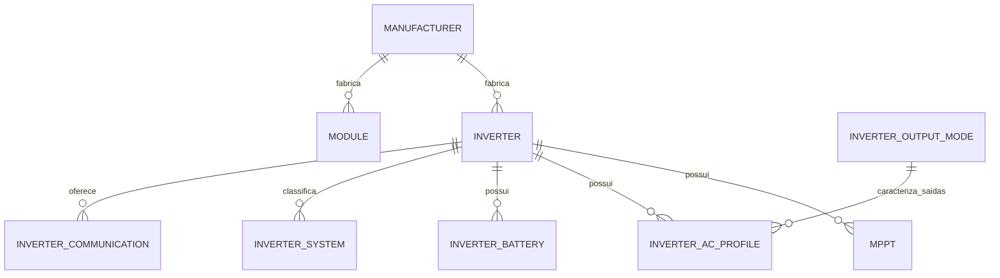

# Etapa 02 — dicionário de dados consolidado da v3

Modelo documental consolidado em 02/10/2026. Não é DDL executável e não representa migração aplicada. O estado físico do SQLite permanece documentado em [ETAPA_02_SCHEMA_ATUAL.md](ETAPA_02_SCHEMA_ATUAL.md); as conferências do snapshot corrente estão em [ETAPA_02_CONFERENCIAS.md](ETAPA_02_CONFERENCIAS.md).

## Convenções

- MySQL/InnoDB e `utf8mb4`; collation Unicode sem diferenciar maiúsculas/minúsculas.
- A aplicação remove espaços externos, reduz sequências internas de espaços a um e preserva a grafia de exibição. Não transforma tudo em maiúsculas.
- PKs: `INT UNSIGNED AUTO_INCREMENT`. `MPPT_INDEX` e `BATTERY_INDEX`: `BIGINT UNSIGNED`, devido ao crescimento do produto de primos.
- Grandezas decimais usam duas casas por padrão. Coeficientes térmicos usam `DECIMAL(8,5)`, pois o legado contém até cinco casas relevantes. A migração não arredonda silenciosamente.
- Unidades: W, V, A, mm, kg, °C, ms e percentual em pontos percentuais (`50.00` = 50%). No CSV da matriz, o contrato existente de sobrecarga em razão decimal é preservado.
- Dado técnico desconhecido ou não aplicável é `NULL`; zero e valores negativos fisicamente válidos não significam ausência. `MPPT_INDEX=0` e `BATTERY_INDEX=0` são códigos estruturais válidos.
- `ACTIVE` significa disponível para uso, não ficha integralmente preenchida. Rascunhos podem ser incompletos.
- `ROW_VERSION` pertence aos agregados editáveis e sustenta concorrência otimista.

## Relações propostas

São **nove tabelas de domínio**: `manufacturer`, `inverter`, `mppt`, `module`, `inverter_ac_profile`, `inverter_battery`, `inverter_system`, `inverter_communication` e `inverter_output_mode`. Tabelas futuras de auditoria, migração ou jobs são metadados técnicos e não entram nessa contagem.

## 1. `manufacturer`

| Campo | Tipo proposto | Nulo/default | Regra |
| --- | --- | --- | --- |
| `ID` | `INT UNSIGNED` PK AI | não | Identidade. |
| `NAME` | `VARCHAR(150)` | não | Nome preservado para exibição; comparação normalizada. |
| `CATEGORY` | `TINYINT UNSIGNED` | não / `0` | `CHECK (CATEGORY IN (0,1,2))`: inversor, módulo ou ambos. |

Índice de busca em `NAME`. Exclusão `RESTRICT` se houver equipamentos. A política final de nomes homônimos de fabricantes continua uma decisão de negócio.

## 2. `inverter`

| Campo | Tipo proposto | Nulo/default | Regra |
| --- | --- | --- | --- |
| `ID` | `INT UNSIGNED` PK AI | não | Identidade. |
| `MODEL` | `VARCHAR(255)` | não | Modelo comercial. |
| `MANUFACTURER_ID` | `INT UNSIGNED` FK | não | Fabricante; exclusão `RESTRICT`. |
| `DIM_WIDTH`, `DIM_HEIGHT`, `DIM_DEPTH` | `DECIMAL(10,2)` | sim / `NULL` | mm; descritivos. |
| `DIM_WEIGHT` | `DECIMAL(10,2)` | sim / `NULL` | kg; descritivo. |
| `MAX_OPERATING_TEMPERATURE`, `MIN_OPERATING_TEMPERATURE` | `DECIMAL(6,2)` | sim / `NULL` | °C; valores negativos são válidos. |
| `COOLING_MODE` | `VARCHAR(150)` | sim / `NULL` | Descritivo extensível. |
| `PROTECTION_DEGREE` | `VARCHAR(100)` | sim / `NULL` | Descritivo extensível. |
| `TOPOLOGY` | `VARCHAR(150)` | sim / `NULL` | Descritivo extensível. |
| `OVERLOAD` | `DECIMAL(7,2)` | sim / `NULL` | Percentual adicional cadastrado. |
| `NUMBER_OF_TRACKERS` | `SMALLINT UNSIGNED` | sim / `NULL` | Total físico de MPPTs. |
| `NUMBER_OF_INPUTS` | `SMALLINT UNSIGNED` | sim / `NULL` | Total físico de entradas FV. |
| `NUMBER_OF_BATTERY_INPUTS` | `SMALLINT UNSIGNED` | sim / `NULL` | Total físico de entradas de bateria; zero=ausência conhecida. |
| `MAX_EFFICIENCY`, `EURO_EFFICIENCY` | `DECIMAL(6,2)` | sim / `NULL` | Eficiências em %. |
| `ACTIVE` | `BOOLEAN` | não / `FALSE` | Disponibilidade no catálogo/matriz. |
| `ROW_VERSION` | `INT UNSIGNED` | não / `1` | Concorrência otimista. |

As cinco grandezas CA legadas saem do pai e migram para um perfil `AC_OUTPUT` padrão. Índices em fabricante/modelo e `ACTIVE`; `UNIQUE(MANUFACTURER_ID, MODEL)` após normalização aprovada e conferência do legado. A conferência atual não encontrou duplicatas.

Inativar o inversor não inativa nem apaga seus filhos: o principal pode consultar e simular equipamento inativo com dados válidos. A matriz exige equipamento ativo.

## 3. `mppt`

| Campo | Tipo proposto | Nulo/default | Regra |
| --- | --- | --- | --- |
| `ID` | `INT UNSIGNED` PK AI | não | Identidade. |
| `INVERTER_ID` | `INT UNSIGNED` FK | não | Pai; exclusão integral do inversor em `CASCADE`. |
| `MPPT_INDEX` | `BIGINT UNSIGNED` | não / `0` | Produto dos primos das posições; `0`=grupo homogêneo. |
| `NUMBER_OF_INPUTS` | `SMALLINT UNSIGNED` | sim / `NULL` | Entradas por MPPT representado. |
| `MAX_INPUT_VOLTAGE`, `MIN_STARTUP_VOLTAGE` | `DECIMAL(10,2)` | sim / `NULL` | Limites em Vcc. |
| `MAX_OPERATING_VOLTAGE`, `MIN_OPERATING_VOLTAGE` | `DECIMAL(10,2)` | sim / `NULL` | Faixa MPPT em Vcc. |
| `MAX_FULL_LOAD_VOLTAGE`, `MIN_FULL_LOAD_VOLTAGE` | `DECIMAL(10,2)` | sim / `NULL` | Faixa de plena carga em Vcc. |
| `RATED_INPUT_VOLTAGE` | `DECIMAL(10,2)` | sim / `NULL` | Tensão CC nominal. |
| `MAX_SHORT_CIRCUIT_CURRENT_PER_MPPT` | `DECIMAL(10,2)` | sim / `NULL` | Limite Isc agregado do MPPT. |
| `MAX_SHORT_CIRCUIT_CURRENT_PER_STRING` | `DECIMAL(10,2)` | sim / `NULL` | Limite Isc por entrada/string, somente com fonte explícita. |
| `MAX_OPERATING_CURRENT_PER_MPPT` | `DECIMAL(10,2)` | sim / `NULL` | Limite operacional agregado do MPPT. |
| `MAX_OPERATING_CURRENT_PER_STRING` | `DECIMAL(10,2)` | sim / `NULL` | Limite operacional por entrada/string, nunca derivado. |

`UNIQUE(INVERTER_ID, MPPT_INDEX)` é aprovado, condicionado à conferência executada — que não encontrou duplicatas. A aplicação também valida fatoração sem repetição, posições existentes, cobertura e ausência de sobreposição; unicidade do código não substitui essas regras.

## 4. `module`

| Campo | Tipo proposto | Nulo/default | Regra |
| --- | --- | --- | --- |
| `ID` | `INT UNSIGNED` PK AI | não | Identidade. |
| `MODEL` | `VARCHAR(255)` | não | Modelo comercial. |
| `MANUFACTURER_ID` | `INT UNSIGNED` FK | não | Fabricante; exclusão `RESTRICT`. |
| `DIM_WIDTH`, `DIM_HEIGHT`, `DIM_DEPTH`, `DIM_WEIGHT` | `DECIMAL(10,2)` | sim / `NULL` | Descritivos mecânicos. |
| `WP` | `DECIMAL(12,2)` | sim / `NULL` | Potência nominal em Wp. |
| `VMPP`, `IMPP`, `VOC`, `ISC` | `DECIMAL(10,2)` | sim / `NULL` | Grandezas elétricas em V/A. |
| `SOLAR_CELLS`, `CELL_TYPE`, `SURFACE_TYPE` | `VARCHAR(100)` | sim / `NULL` | Textos extensíveis, sem checks de vocabulário. |
| `COEF_PMAX`, `COEF_VOC`, `COEF_ISC` | `DECIMAL(8,5)` | sim / `NULL` | %/°C; preserva a precisão efetiva encontrada. |
| `ACTIVE` | `BOOLEAN` | não / `FALSE` | Disponibilidade no catálogo/matriz. |
| `ROW_VERSION` | `INT UNSIGNED` | não / `1` | Concorrência otimista. |

`UNIQUE(MANUFACTURER_ID, MODEL)` após normalização. A conferência atual não encontrou duplicatas. O principal pode usar módulo inativo com dados válidos; a matriz exige módulo ativo.

## 5. `inverter_ac_profile`

Cada linha é um perfil elétrico coerente. Valores de linhas diferentes nunca são combinados para fabricar um perfil. `PROFILE_TYPE` é controlado pelo sistema, com rótulos localizados na interface.

| Campo | Tipo proposto | Nulo/default | Aplicabilidade |
| --- | --- | --- | --- |
| `ID` | `INT UNSIGNED` PK AI | não | Identidade do perfil. |
| `INVERTER_ID` | `INT UNSIGNED` FK | não | Pai; exclusão integral em `CASCADE`. |
| `PROFILE_TYPE` | `VARCHAR(16)` | não | `CHECK IN ('AC_OUTPUT','AC_INPUT','EPS_OUTPUT')`. |
| `OUTPUT_MODE_ID` | `INT UNSIGNED` FK | sim / `NULL` | Obrigatório para saída ativa `AC_OUTPUT`/`EPS_OUTPUT`; não aplicável a `AC_INPUT`. |
| `RATED_ACTIVE_POWER` | `DECIMAL(12,2)` | sim / `NULL` | Potência contínua nominal; base da sobrecarga em perfis de saída. |
| `MAX_ACTIVE_POWER` | `DECIMAL(12,2)` | sim / `NULL` | Máximo não-pico quando informado. |
| `MAX_PEAK_ACTIVE_POWER` | `DECIMAL(12,2)` | sim / `NULL` | Pico, tipicamente EPS; não substitui nominal. |
| `RATED_LINE_TO_LINE_VOLTAGE` | `DECIMAL(10,2)` | sim / `NULL` | Tensão nominal fase–fase, de entrada ou saída conforme o tipo. |
| `RATED_LINE_TO_NEUTRAL_VOLTAGE` | `DECIMAL(10,2)` | sim / `NULL` | Tensão nominal fase–neutro, de entrada ou saída conforme o tipo. |
| `RATED_CURRENT` | `DECIMAL(10,2)` | sim / `NULL` | Entrada ou saída conforme o tipo. |
| `MAX_CURRENT` | `DECIMAL(10,2)` | sim / `NULL` | Entrada ou saída conforme o tipo. |
| `SWITCHING_TIME` | `DECIMAL(10,2)` | sim / `NULL` | ms; aplicável a EPS. Desconhecido não vira zero. |
| `ACTIVE` | `BOOLEAN` | não / `FALSE` | Disponível para escolha/cálculo. |
| `IS_DEFAULT` | `BOOLEAN` | não / `FALSE` | Perfil de saída inicialmente usado pelo motor. |

### Aplicabilidade por tipo

| Campo | `AC_OUTPUT` | `AC_INPUT` | `EPS_OUTPUT` |
| --- | --- | --- | --- |
| `OUTPUT_MODE_ID` | necessário quando ativo | `NULL` | necessário quando ativo |
| `RATED_ACTIVE_POWER` | potência nominal de saída | potência nominal absorvida | potência contínua EPS |
| `MAX_ACTIVE_POWER` | aplicável | aplicável | aplicável se o datasheet distinguir máximo contínuo |
| `MAX_PEAK_ACTIVE_POWER` | normalmente `NULL` | `NULL` | aplicável |
| tensões fase–fase/fase–neutro e correntes | saída | entrada | saída EPS |
| `SWITCHING_TIME` | `NULL` | `NULL` | aplicável |
| `IS_DEFAULT` | permitido | sempre `FALSE` | permitido |

Índices em `INVERTER_ID`, `PROFILE_TYPE`, `OUTPUT_MODE_ID` e `(INVERTER_ID, ACTIVE)`. O banco garante o vocabulário e booleanos. Uma restrição/índice funcional deve garantir no máximo um perfil de saída padrão por inversor; a implementação MySQL será definida no DDL, pois unicidade condicional requer solução específica.

O serviço garante que o padrão esteja ativo, seja `AC_OUTPUT` ou `EPS_OUTPUT` e seja compatível com a classificação. On-grid/híbrido iniciam com `AC_OUTPUT`; off-grid inicia com `EPS_OUTPUT`. `AC_INPUT` nunca é padrão. Trocar o padrão e excluir/inativar o antigo ocorre na mesma transação. Um rascunho pode temporariamente não ter padrão, mas não está pronto para cálculo.

O usuário pode escolher outro perfil de saída ativo na sessão; isso não muda `IS_DEFAULT`. Sem padrão válido nem seleção explícita válida, o fluxo solicita escolha. Nunca escolhe maior, menor ou primeira linha. A matriz e o resultado carregam `profile_id`, tipo, modo, tensões fase–fase/fase–neutro e potência nominal efetivamente usados.

### Referências de tensão

Não existe uma terceira tensão nominal genérica. `NULL` significa desconhecido ou não aplicável e nunca é convertido em zero. Exemplos exclusivamente ilustrativos:

| Configuração | Fase–fase | Fase–neutro |
| --- | ---: | ---: |
| Trifásico, três fios, 380 V, sem referência L–N aplicável | 380,00 | `NULL` |
| Trifásico, quatro fios, 380/220 V | 380,00 | 220,00 |
| Monofásico fase–neutro, 220 V | `NULL` | 220,00 |
| Monofásico entre fases, 220 V | 220,00 | `NULL` |

Uma configuração 380/220 V é um perfil; opções 380 V e 480 V são perfis distintos. Não se calcula uma tensão a partir da outra, não se presume relação universal e `SINGLE_PHASE` sozinho não informa qual referência contém o valor. Potência nominal continua vindo de `RATED_ACTIVE_POWER`, sem fórmula nova baseada em tensão/corrente.

Rótulos da interface: **Tensão nominal fase–fase (V)** e **Tensão nominal fase–neutro (V)**. Um equipamento confirmado para três e quatro fios em 380 V e 480 V pode ter quatro perfis, cada qual com potência/correntes próprias. Isso não autoriza gerar quatro combinações para todos os equipamentos.

## 6. `inverter_battery`

Representa grupos de entradas físicas com características compartilhadas, usando a mesma codificação por produtos de primos dos MPPTs.

| Campo | Tipo proposto | Nulo/default | Regra |
| --- | --- | --- | --- |
| `ID` | `INT UNSIGNED` PK AI | não | Identidade. |
| `INVERTER_ID` | `INT UNSIGNED` FK | não | Pai; exclusão integral em `CASCADE`. |
| `BATTERY_INDEX` | `BIGINT UNSIGNED` | não / `0` | Produto dos primos das posições; `0`=grupo homogêneo de todas as entradas conhecidas. |
| `BATTERY_TYPE` | `VARCHAR(150)` | sim / `NULL` | Tecnologia/família suportada. |
| `BATTERY_VOLTAGE_MIN`, `BATTERY_VOLTAGE_MAX` | `DECIMAL(10,2)` | sim / `NULL` | Faixa em V por entrada representada pelo grupo. |
| `MAX_CHARGE_CURRENT`, `MAX_DISCHARGE_CURRENT` | `DECIMAL(10,2)` | sim / `NULL` | A por entrada representada pelo grupo, somente com evidência explícita. |
| `BATTERY_COM` | `VARCHAR(150)` | sim / `NULL` | Comunicação compatível. |
| `ACTIVE` | `BOOLEAN` | não / `FALSE` | Grupo disponível. |

Não há “baterias por entrada”, bancos instalados, limite CAN, junction box, autonomia ou estado de carga. Limite total compartilhado do inversor não é dividido nem copiado para cada entrada; se essa grandeza aparecer em datasheets, será necessário decidir uma coluna agregada própria.

Validações do serviço:

- fatorar somente pelos primos das posições de `1..NUMBER_OF_BATTERY_INPUTS`;
- rejeitar `1`, fatores repetidos, fatores residuais e posições inexistentes;
- impedir sobreposição entre grupos ativos;
- impedir grupo homogêneo ativo `0` coexistindo com qualquer outro grupo ativo;
- exigir revisão da cobertura quando a quantidade total for desconhecida ou alterada;
- preservar inativos, que não ocupam posições; reativação revalida tudo;
- conferir overflow antes de persistir.

Não se usa `UNIQUE(INVERTER_ID, BATTERY_INDEX, ACTIVE)`, pois impediria mais de um histórico inativo com o mesmo índice. A proposta usa índice não único `(INVERTER_ID, BATTERY_INDEX)` e valida unicidade/sobreposição apenas entre ativos dentro da transação e sob bloqueio/revisão do agregado. A igualdade do produto não substitui a interseção dos conjuntos.

## 7. `inverter_system`

| Campo | Tipo proposto | Nulo/default | Regra |
| --- | --- | --- | --- |
| `ID` | `INT UNSIGNED` PK AI | não | Identidade. |
| `INVERTER_ID` | `INT UNSIGNED` FK | não | Pai; exclusão integral em `CASCADE`. |
| `SYSTEM_TYPE` | `VARCHAR(100)` | não | Vocabulário extensível; sem check fechado nesta tabela. |

On-grid e híbrido requerem saída `AC_OUTPUT` para ficarem prontos; off-grid requer `EPS_OUTPUT`, sem saída CA fictícia. Entrada CA é permitida para híbridos; bateria/EPS aplicam-se a híbridos/off-grid. Desmarcar capacidade inativa dependentes na mesma transação e preserva dados; reativar não reativa filhos automaticamente.

## 8. `inverter_communication`

| Campo | Tipo proposto | Nulo/default | Regra |
| --- | --- | --- | --- |
| `ID` | `INT UNSIGNED` PK AI | não | Identidade. |
| `INVERTER_ID` | `INT UNSIGNED` FK | não | Pai; exclusão integral em `CASCADE`. |
| `COMMUNICATION_TYPE` | `VARCHAR(100)` | não | Valor extensível, sem check fechado. |

Índices em inversor e tipo. A existência da linha declara suporte; não precisa de `ACTIVE` próprio.

## 9. `inverter_output_mode`

Catálogo global cadastrável, não associação direta com inversor.

| Campo | Tipo proposto | Nulo/default | Regra |
| --- | --- | --- | --- |
| `ID` | `INT UNSIGNED` PK AI | não | Identidade global. |
| `OUTPUT_MODE` | `VARCHAR(100)` | não | Nome extensível, com unicidade após normalização. |
| `ACTIVE` | `BOOLEAN` | não / `TRUE` | Disponível para novos perfis; referências antigas permanecem. |

Perfis de saída referenciam o catálogo com exclusão `RESTRICT`. `AC_INPUT.OUTPUT_MODE_ID` deve ser `NULL`; o modelo não amplia silenciosamente “modo de saída” para entrada.

## Dados mínimos por estado e operação

Esta tabela separa o que o motor atual realmente consome de dados apenas descritivos. Regras novas não aprovadas são marcadas como proposta.

| Situação | Mínimo obrigatório |
| --- | --- |
| Salvar rascunho de inversor | Identidade técnica do rascunho e `ROW_VERSION`; campos elétricos, grupos e padrão podem estar incompletos. **Proposta:** exigir modelo e fabricante apenas ao promover/salvar como item de catálogo, não em autosave temporário. |
| Disponibilizar perfil de saída | Tipo de saída, inversor, `OUTPUT_MODE_ID`, potência nominal positiva, `ACTIVE=TRUE`; coerência da classificação. As duas referências de tensão e correntes são necessárias para filtros que as usem, mas não para a fórmula FV atual. |
| Disponibilizar perfil `AC_INPUT` | Tipo, inversor e ao menos uma grandeza técnica que caracterize a entrada; `OUTPUT_MODE_ID=NULL`, `IS_DEFAULT=FALSE`. O conjunto mínimo exato é decisão de negócio. |
| Calcular compatibilidade FV | Inversor; perfil de saída ativo escolhido/padrão com potência nominal positiva; sobrecarga cadastrada válida ou percentual de sessão; número de MPPTs/entradas; grupos MPPT válidos com entradas, faixas de tensão aplicáveis e limites de corrente necessários ao modo; módulo com `WP`, `VMPP`, `IMPP`, `VOC`, `ISC`, `COEF_VOC` e `COEF_ISC`; temperaturas/opções da sessão. `COEF_PMAX` é usado na tela principal para potência compensada, embora o motor de compatibilidade estruturado use potência nominal na potência DC exibida. |
| Calcular ignorando corrente operacional | Mesmo conjunto, exceto que a ausência/limite de corrente operacional não bloqueia; curto-circuito, tensão, entradas, Full Load e sobrecarga continuam válidos. |
| Usar na matriz | Todos os mínimos do cálculo, além de inversor, módulo e perfil ativos. |
| Consultar/simular no principal | Equipamento pode estar inativo; dados necessários ao cálculo e perfil selecionado devem ser válidos. |

Dimensões, massa, refrigeração, proteção, topologia, eficiências, classificações da célula, comunicação, tensão nominal MPPT e grandezas não usadas pela opção selecionada são descritivas ou de filtro; sua ausência não deve bloquear todo cálculo.

## Contrato de seleção e cálculo

O contexto futuro deve identificar ao menos `inverter_id`, `inverter_row_version`, `ac_profile_id`, `profile_type`, `output_mode_id`, as duas referências de tensão, `module_id`, opções/temperaturas e sobrecarga efetiva. O resultado guarda a mesma identidade. A fórmula recebe a potência nominal do perfil selecionado; não escolhe perfil, não soma CA/EPS e não usa pico como nominal.

Filtros CA pertencem a uma única linha e ao tipo solicitado. O filtro fase–fase consulta apenas `RATED_LINE_TO_LINE_VOLTAGE`; o filtro fase–neutro consulta apenas `RATED_LINE_TO_NEUTRAL_VOLTAGE`. Limites são inclusivos e mínimo igual ao máximo representa igualdade. Potência, tensão e demais critérios combinados devem ser satisfeitos pelo mesmo perfil. Consultas 1:N retornam cada inversor uma vez (`EXISTS`, agregação adequada ou deduplicação por ID).

## Banco versus aplicação

O banco garante FKs, tipos, `PROFILE_TYPE`, categoria, booleanos, unicidades simples aprovadas, não negatividade física, relações mínimo/máximo locais e proteção referencial. A aplicação/serviço garante:

- normalização textual antes da comparação;
- completude por estado e compatibilidade entre sistema/perfis;
- seleção e troca transacional do padrão;
- coerência de MPPT/bateria, fatoração, cobertura e sobreposição;
- revisão otimista do agregado e repetição segura após conflito;
- inativação transacional de dependentes quando uma capacidade some;
- preservação de inativos e ausência de reativação indiscriminada;
- escolha explícita do perfil em cálculo, matriz e detalhes.

Atualizações do agregado usam `ROW_VERSION` no `WHERE`; se nenhuma linha for afetada, a transação falha por conflito. Troca do padrão primeiro valida o substituto e, numa única transação, define o novo e remove/inativa o antigo, sem estado intermediário persistido.

## Mapeamento futuro do SQLite

| Origem | Destino | Tratamento aprovado |
| --- | --- | --- |
| `inverter` sem cinco grandezas CA | `inverter` | Preservar identidade; converter somente sentinelas conhecidas por campo para `NULL`. |
| potência/correntes CA de inversor com um modo | um `inverter_ac_profile` `AC_OUTPUT` | Copiar potência nominal/máxima e correntes nominal/máxima; manter proveniência. Não criar EPS/entrada/bateria. |
| potência/correntes CA dos 56 inversores com dois modos | dois perfis `AC_OUTPUT` por inversor (112 no total) | Uma cópia por modo, com os mesmos valores legados inicialmente e revisão manual obrigatória; não duplicar inversor, MPPTs ou demais relações. |
| `inverter.RATED_OUTPUT_VOLTAGE` | uma das duas tensões do perfil, após evidência | Não inferir pela razão, modo ou modelo. Preservar valor/origem na reconciliação se fase–fase versus fase–neutro for ambíguo; a outra referência fica `NULL`. |
| `inverter_output_mode` legado | catálogo global + um `OUTPUT_MODE_ID` por perfil | Os 257 casos unívocos geram um perfil; os 56 casos confirmados geram dois, um por modo. Registrar `(inverter legado, modo) → perfil` para reexecução idempotente. |
| `mppt.MAX_SHORT_CIRCUIT_CURRENT` / `MAX_OPERATING_CURRENT` | colunas `*_PER_MPPT` | Campos por string permanecem `NULL`. |
| `MPPT_INDEX=0` | mesmo código | Preservar grupo homogêneo. |
| relações de sistema/comunicação | tabelas homônimas | Preservar valores; remover somente checks de vocabulário solicitados. |
| módulo | `module` | Preservar coeficientes com cinco casas; demais grandezas suportam duas no snapshot conferido. |

Não existem inversores **exclusivamente** off-grid no legado: as 21 relações `OFF-GRID` pertencem a equipamentos também classificados como híbridos e on-grid. Conforme a decisão de negócio fornecida, os cinco campos CA atuais, inclusive nesses híbridos, são saída CA principal. Todos os 313 inversores possuem modo atualmente; os 56 multimodo recebem dois perfis autorizados, mas permanecem em revisão até o usuário escolher exatamente um padrão e conferir tensões/potências/correntes por configuração.

Para os 56 casos, não copiar `IS_DEFAULT=TRUE` para ambos e não escolher por ordem, ID ou potência. Os dois perfis são reconciliados como rascunhos; a promoção para uso exige seleção explícita de um único padrão. Não gerar opções de 480 V nem outras combinações por fabricante/modelo: configurações adicionais só entram com fonte confirmada.

## Contrato de apresentação

Identidades persistidas permanecem estáveis; os rótulos são compartilhados por cadastros, filtros, detalhes e interfaces desktop/web:

| Identidade persistida | Rótulo aprovado |
| --- | --- |
| `ON-GRID` | On grid |
| `OFF-GRID` | Off grid |
| `GRIDZERO` | Grid zero |
| `HYBRID` | Híbrido |
| `SPLIT PHASE` | Splitphase |
| `THREE_PHASE_FOUR_WIRE` | Trifásico a quatro fios |
| `THREE_PHASE_THREE_WIRE` | Trifásico a três fios |
| `SINGLE_PHASE` | Monofásico |

`SPLIT PHASE` já existe como identidade futura prevista no código; não se cria `SPLIT_PHASE` nesta etapa. Alterar rótulo não habilita funcionalidade. Comunicações e rótulos não solicitados permanecem como estão; não se implanta infraestrutura ampla de internacionalização nesta revisão.

## Decisões aprovadas incorporadas

- Nove tabelas de domínio e perfil CA unificado.
- Tipos de perfil fechados e textuais: `AC_OUTPUT`, `AC_INPUT`, `EPS_OUTPUT`.
- Perfil padrão explícito, único e transacional; escolha de sessão não altera cadastro.
- Potência nominal, máxima e pico separadas.
- `ACTIVE` como disponibilidade, distinta de completude.
- Principal admite equipamento inativo válido; matriz exige ativo; perfil inativo nunca é calculável.
- Bateria agrupada por produto de primos, `0` homogêneo, com total físico no inversor.
- `NULL` para ausência, duas casas por padrão e cinco para coeficientes térmicos.
- Unicidade de fabricante+modelo e inversor+índice MPPT condicionada à conferência, agora sem conflitos encontrados.
- Modos de saída como catálogo global extensível.
- Cinco campos CA legados migram somente para perfis `AC_OUTPUT`; casos unívocos podem receber o padrão, enquanto os duplicados aguardam escolha explícita.
- Os 56 inversores com dois modos geram 112 perfis `AC_OUTPUT`, sujeitos a revisão e escolha de um único padrão por inversor.
- Tensões nominais são explicitamente fase–fase e fase–neutro; não há tensão genérica nem derivação automática.
- Rótulos aprovados são separados das identidades persistidas.

## Ambiguidades de negócio restantes

1. Qual conjunto mínimo torna um perfil `AC_INPUT` disponível, já que ele não participa do cálculo FV atual? **Proposta:** exigir ao menos tensão nominal em uma referência ou corrente/potência nominal, além de tipo, inversor, atividade e `IS_DEFAULT=FALSE`; validar o conjunto exato antes do DDL.
2. Nomes idênticos de fabricantes após normalização devem ser proibidos globalmente ou diferenciados por alguma identidade externa? **Proposta:** unicidade global do nome normalizado, com fluxo explícito de mesclagem/renomeação para exceções.

Revisões de dados ainda necessárias: escolher o padrão dos 56 pares duplicados e classificar a tensão legada como fase–fase ou fase–neutro com evidência. Corrente total compartilhada de bateria continua uma extensão hipotética: nenhum caso concreto foi demonstrado; não se adiciona coluna sem fonte. A versão real do MySQL e a solução física para unicidade condicional do padrão são validações técnicas posteriores, não decisões de negócio reabertas.

Após revisão dessas ambiguidades, o próximo marco é preparar DDL e plano de migração em ambiente de teste. Esta etapa não os executa.
